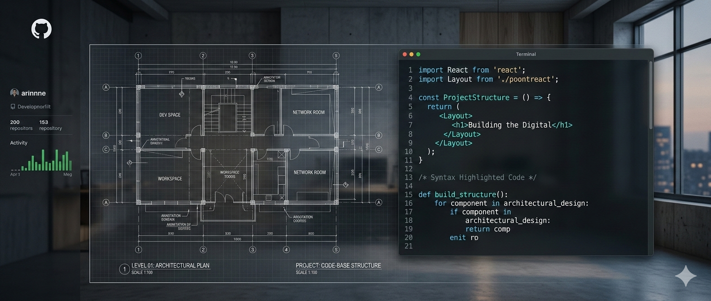

# 🏗️ Blueprint of a Developer: Hola! Soy Micaela Besasso

> "En la arquitectura, como en el código, si los cimientos no son sólidos, la estética no tiene propósito."

Soy una **Desarrolladora Full Stack** peeero también he pasado por **Arquitectura**. Mi camino me llevó desde diseñar espacios físicos en Buenos Aires hasta descubrir mi pasión en Formentera: **construir estructuras digitales**.

---

### 🚀 ¿En qué estoy trabajando?

- 🔭 **Proyecto Destacado:** **UpgradeFood**, una plataforma con lógica de backend optimizada para la gestión de asignaciones.
- 🌱 **Perfeccionando:** Gestión de estado y reactividad con **Signals** en Angular.
- ⚡ **Mi enfoque:** Código limpio, escalable y una experiencia de usuario (UX) impecable forjada en el sector hospitality.

### 🛠️ Tecnologías y Herramientas

    

---

### 📊 Mis Estadísticas

---

### 📫 ¡Construyamos algo juntos!

- **LinkedIn:** [linkedin.com/in/micaela-besasso/](https://linkedin.com/in/micaela-besasso/)
- **Email:** [micaela.besasso@hotmail.com](mailto:micaela.besasso@hotmail.com)
- **Idiomas:** Español (Nativo), Italiano (C1), Inglés (B2)
